<p align="center">
  
  
  
  
  
  
  
  
  <br>
  
  
  
</p>

<!-- agent-managed badges START -->
<p align="center">
  <a href="https://arcana.boo/sonarqube/dashboard?id=esp32-app"></a>
  <a href="https://arcana.boo/jenkins/job/esp32-app-pipeline-mb/job/main/"></a>
</p>
<!-- agent-managed badges END -->
<!-- arch-rank START -->
<p align="center">
  
  
  
</p>
<!-- arch-rank END -->

<h1 align="center">Arcana Embedded ESP32</h1>

<p align="center">
  <strong>Modern C++23 IoT platform: Service Pattern + Observable Event System + Encrypted Command Pipeline</strong>
</p>

<p align="center">
  <a href="#architecture-evaluation">Evaluation</a> &bull;
  <a href="#system-architecture">Architecture</a> &bull;
  <a href="#service-pattern">Service Pattern</a> &bull;
  <a href="#controller-lifecycle">Controller</a> &bull;
  <a href="#data-flow">Data Flow</a> &bull;
  <a href="#arcana-frame-protocol">Frame Protocol</a> &bull;
  <a href="#command-protocol">Command Protocol</a> &bull;
  <a href="#security">Security</a> &bull;
  <a href="#ble-dual-role">BLE</a> &bull;
  <a href="#observable-pattern">Observable</a> &bull;
  <a href="#supported-boards">Boards</a> &bull;
  <a href="#getting-started">Getting Started</a>
</p>

---

## Architecture Score

| Dimension | Score | Notes |
|-----------|-------|-------|
| **Architecture Pattern** | 9.5/10 | 5-phase AppContainer lifecycle; MVVM display layer; TOFU provisioning; graceful storage degradation; single big `main/` component organised by layer (`service/transport/db/command/view/driver/core`) |
| **Security** | 9.5/10 | AES-256-CCM commands + ECDH PFS + replay protection + 7 attack mitigations; all device↔cloud transport now TLS (HTTPS registration/upload, MQTTS 8883); registration response on HW AES-256-CTR |
| **Protocol Design** | 9/10 | Unified Frame + protobuf across BLE/MQTT, shared wire format with STM32 |
| **Extensibility** | 9/10 | New command = 1 class + 1 factory case; new service = abstract + impl |
| **Observable System** | 9/10 | Sync/async modes, RAII subscription, WeakObserver, 3 template variants |
| **Storage / Persistence** | 8/10 | ArcanaTs time-series DB, **HW AES-256-CTR** (`Esp32AesCtrCipher`, both ESP32 + ESP32-S3 have AES accelerators; ChaCha20 is the STM32-only path) + CRC32; raw-FatFs port lifts the daily file off the old 2 GB stdio cap to the FAT32 **4 GB** ceiling; optional SD; graceful degradation |
| **Resource Efficiency** | 7/10 | ~12 async Observable tasks; MVVM render via task notification (zero idle cost); ESP-IDF 6.0 picolibc shrinks libc footprint |
| **Thread Safety** | 8/10 | Mutex-protected crypto sessions; std::string in queue (High issue) |
| **Testing** | 10/10 | 21 host tests, all passing. **100.0% line coverage** (2798/2798 lines, 0 uncovered) verified by Sonar. mbedtls fault-injection via linker `--wrap`, FlakyFilePort precise call-count injection, IEC 62304 §5.5.3 LCOV_EXCL annotations on defensive paths |
| **Toolchain** | 9/10 | ESP-IDF 6.0 / mbedtls 4.0 / picolibc / xtensa-esp-elf 15.2 — current stable LTS supported through Sep 2028; CI pinned to `espressif/idf:v6.0` |
| **Documentation** | 9.5/10 | Comprehensive README with data flows, protocol spec, security analysis |
| **Overall** | **9.1/10** | Mature IoT platform — strong security, MVVM, provisioning, persistent storage, **production-grade test coverage** and current toolchain. Limited only by minor polling/naming issues and a latent broker-side ACL bug |

---

## Architecture Evaluation

### Pros

| # | Strength | Details |
|---|----------|---------|
| 1 | **Service pattern with Input/Output wiring** | Services declare typed dependencies as struct fields; Controller wires Observable pointers at startup, achieving compile-time dependency injection without a DI framework. All 8 services (Timer, Sensor, BLE, MQTT, LED, LCD, Command, Bridge) follow this pattern consistently |
| 2 | **Task ownership rule** | ServiceImpl never calls `xTaskCreate`. Observable owns dispatch tasks; `esp_timer` owns periodic behavior. Concurrency management is centralized, not scattered across services |
| 3 | **Dual-rate TimerService** | Single `esp_timer` at 100ms with counter divider for 1000ms. Services choose FastTimer or BaseTimer based on their needs. Adding a new rate is one divider counter away |
| 4 | **Unified command pipeline** | BLE and MQTT share identical wire format (Frame + protobuf + AES-256-CCM). Single CommandCodec handles both transports |
| 5 | **Perfect Forward Secrecy** | ECDH P-256 session keys are independent of PSK; compromised PSK does not expose past sessions. Per-connection isolation (4 slots). Duplicate KeyExchange requests rejected (prevents CPU exhaustion and session overwrite) |
| 6 | **Two-stage event pipelines** | Sensor/Timer events flow: sync Observable (producer task) -> async Observable (dedicated dispatch task), cleanly decoupling producers from consumers |
| 7 | **4-phase Controller lifecycle** | `wireServices -> initHAL -> initServices -> startServices` with SNTP init between WiFi and service start. Late-wiring pattern for bridge inputs ensures dependencies are initialized first |
| 8 | **Protocol layering** | Frame (magic + CRC) / Encryption (AES-CCM) / Serialization (protobuf) -- each layer is independently testable and transport-agnostic |
| 9 | **Extensibility** | Adding a command = 1 header-only class + 1 factory switch case. Adding a service = abstract base + singleton impl + wire in Controller |
| 10 | **Sensor data fan-out** | Single `SensorDataEvents` Observable feeds 3 subscribers (BLE GATT notify, LCD display, MQTT JSON publish) with zero coupling between consumers. Adding a new subscriber is one `input.SensorDataEvents` wire |
| 11 | **Credentials separation** | WiFi SSID/password and MQTT broker IP stored in gitignored `sdkconfig.credentials`, auto-layered via CMake `SDKCONFIG_DEFAULTS`. No secrets in repository; `sdkconfig.credentials.example` provides template |
| 12 | **NTP time sync** | SNTP initialized after WiFi, before MQTT start. Non-blocking background sync ensures MQTT sensor payloads carry Unix epoch timestamps instead of boot-relative milliseconds |
| 13 | **Replay protection** | CryptoEngine tracks RX counter watermark per session; decrypted frames with counter <= last accepted are rejected. Prevents replay of intercepted encrypted commands |
| 14 | **Defense-in-depth frame validation** | FrameCodec rejects zero-length payloads and payloads exceeding `kMaxPayloadLen` (300 bytes) before CRC check. Compile-time `static_assert` ensures limit accommodates max encrypted response (289 bytes). Rejects garbage at the earliest layer |
| 15 | **Value-semantic async events** | All types passed through async Observable queues are POD/value types. `MqttCommandEvent` uses fixed-size `uint8_t[298]` array (not pointer), eliminating use-after-free risk from MQTT buffer recycling |
| 16 | **Nonce exhaustion guard** | TX counter checked against `UINT32_MAX` before encryption; refuses to encrypt when counter exhausted, preventing nonce reuse that would break AES-CCM confidentiality |
| 17 | **Mutex-protected crypto sessions** | `DecryptWithSession` / `EncryptWithSession` hold `KeyExchangeManager` mutex during the entire crypto operation. Eliminates raw-pointer use-after-free when `RemoveSession` races with decrypt/encrypt on another task |
| 18 | **BLE client slot thread safety** | `BleGattServer::mClientsMutex` serializes all `mClients[]` access across BTC task (GATTS events), sensor task (`NotifyTemperature`/`NotifyHumidity`), and command response task (`SendCommandResponse`). Prevents cross-core cache incoherence on dual-core ESP32 |
| 19 | **BLE Prepare Write rejection** | Command characteristic rejects `is_prep` writes with `ESP_GATT_REQ_NOT_SUPPORTED` and zero-length writes with `ESP_GATT_INVALID_ATTR_LEN`, preventing partial frame injection and protocol confusion |
| 20 | **Compile-time wire size validation** | `static_assert(kMaxPayloadLen >= arcana_CmdResponse_size + CryptoEngine::kOverhead)` in CommandCodec catches payload size mismatches at compile time. Guarantees FrameCodec limit always accommodates the largest legal encrypted response |
| 21 | **Protobuf field range validation** | Cluster and command values validated `<= 0xFF` after protobuf decode, before narrowing `static_cast`. Prevents attacker from sending `cluster=0x100` to truncate to `0x00` and bypass command dispatch |
| 22 | **MVVM display layer** | `LcdViewModel` subscribes to Service Observables and transforms data into `LcdOutput` with per-field dirty flags (`DIRTY_SENSOR`, `DIRTY_STORAGE`, `DIRTY_TIME`, `DIRTY_TOAST`). `MainView` owns a FreeRTOS render task that blocks on `ulTaskNotifyTake` — woken only when ViewModel has new data. Clean separation: ViewModel has no rendering code; MainView has no service subscriptions. Zero idle cost (no polling) |
| 23 | **WifiService encapsulates network** | `WifiService` abstract interface exposes `connect()`, `syncNtp()`, `isConnected()`. Replaces `protocol_examples_common` / `example_connect()` dependency. `AppContainer::run()` calls `mWifi->connect()` then `mWifi->syncNtp(10000)` before `startServices()` — explicit, readable sequencing |
| 24 | **TOFU device provisioning** | `RegistrationService` implements Trust-On-First-Use: first boot sends `POST /api/register` to obtain MQTT credentials + `comm_key`, stored in `device.ats`. Subsequent boots load from storage. Device ID is MAC-based hex string. Credentials struct carries `mqttUser`, `mqttPass`, `mqttBroker`, `mqttPort`, `uploadToken`, `topicPrefix`, and 32-byte `commKey` |
| 25 | **ArcanaTs time-series DB** | Custom append-only binary database. Single `.ats` file per day on SD (FAT32 SPI), 4KB block writes, 508 records/block (DHT11 = 8 bytes/rec). Pluggable `ICipher` (ChaCha20 / AES-CTR / Null) and `IFilePort` (VFS) interfaces. CRC-32 integrity per block. Daily midnight file rotation. Permanent `device.ats` for lifecycle/credentials |
| 26 | **Graceful storage degradation** | `AppContainer::initHAL()` calls `mStorage->init_HAL()` without `ESP_ERROR_CHECK`. If SD init fails, `mStorage` is set to `nullptr`; all subsequent storage guards (`if (mStorage)`) skip storage-dependent logic. System continues without storage — BLE, MQTT, sensor, and command pipeline unaffected |
| 27 | **IoService button abstraction** | GPIO button state machine behind abstract interface. Button A (GPIO5 active-LOW): press+release → upload request; during upload → cancel. Button B (GPIO36 active-LOW): hold 2s → format SD. `armCancel()` / `disarmCancel()` let `AppContainer` control cancel semantics without IoService knowing upload state |
| 28 | **SensorData fan-out expands to 4 subscribers** | `output.DataEvents` now feeds `BleTransportService` (GATT notify), `LcdViewModel` (MVVM display), `MqttTransportService` (JSON publish), and `AtsStorageService` (time-series write to SD). Adding a new subscriber is one `input.SensorDataEvents` wire in `wireServices()` |
| 29 | **Upload-then-reconnect flow** | HTTP file upload temporarily disconnects MQTT (`mqtt->stop()`), uploads all pending `.ats` files via `HttpUploadService`, then reconnects MQTT (`mqtt->start()`). Progress updates flow through `ViewModel::showToast()` via lambda callback — upload logic in AppContainer stays transport-agnostic |
| 30 | **Atomic Android-style layered restructure** | All 15 ESP-IDF components were collapsed into one big `main/` component organised by layer: `main/{service,transport,db,command,view,driver,core}/`. Discovery via `git log` is by feature, not by component name. Cross-layer encapsulation is enforced by code review (ESP-IDF used to enforce it via `REQUIRES`); single-component build is faster and the layout mirrors the Arcana Android app one-for-one |
| 31 | **100% line coverage with fault injection** | 21 host-side tests (`Tests/test_*.cpp`) build under Debian gcc:12 + libmbedtls-dev. Sonar reports **100.0% line coverage (2798/2798 lines, 0 uncovered)**. Fault injection via two mechanisms: (a) `Tests/mocks/mbedtls_wrap.cpp` `__wrap_*` symbols on 13 mbedtls APIs driven by `g_fail_*` flags + counter-based `_after_n` injection; (b) `FlakyFilePort` test cipher driver with precise call-count failure points. Defensive RTOS-failure paths (queue full, mutex create, etc.) annotated with `LCOV_EXCL` per IEC 62304 §5.5.3 |
| 32 | **ESP-IDF 6.0 / mbedtls 4.0 compatibility shim** | Production crypto code (`CryptoEngine`, `KeyExchangeManager`, `Esp32AesCtrCipher`, `RegistrationServiceImpl`) uses `mbedtls/private/{aes,ccm,sha256,ecdh}.h` headers behind `#define MBEDTLS_DECLARE_PRIVATE_IDENTIFIERS`. Avoids the multi-day PSA Crypto API rewrite that mbedtls 4.0 nominally requires while staying officially supported via the documented escape hatch. Host tests link Debian system mbedtls 2.28 via `Tests/mocks/mbedtls/private/*.h` redirector stubs that map back to legacy public headers — same source compiles in both environments |
| 33 | **EspRng wrapper bypasses PSA Crypto migration** | mbedtls 4.0 deleted the entire `mbedtls_entropy_*` and `mbedtls_ctr_drbg_*` API (PSA Crypto owns randomness now). `main/command/security/EspRng.hpp` provides a 10-line wrapper exposing `esp_fill_random()` (ESP32 hardware TRNG) under the legacy `int (*)(void*, unsigned char*, size_t)` f_rng callback signature. `mbedtls_ecp_gen_keypair` / `mbedtls_ecdh_compute_shared` continue to work unchanged, no PSA key handles, no `psa_crypto_init()` ceremony |
| 34 | **Editor-side clangd config** | `.clangd` at project root pins compile flags (`CompilationDatabase: ./build`, `Remove: [-m*, -f*]`) and suppresses the `attribute_not_type_attr` false positive that picolibc's `pthread.h` triggers in clangd's strict C++11 parser. GCC build is unaffected — pure LSP-side analyzer config. Same file is consumed by Eclipse (Espressif IDF plugin), VS Code, Neovim and any other clangd-backed editor |

### Cons

| # | Issue | Severity | Details | Location |
|---|-------|----------|---------|----------|
| 1 | **`SensorError` contains `std::string`** | **High** | `SensorError::Message` is `std::string`. Passing through FreeRTOS queue (`xQueueSend` does raw `memcpy`) would bypass copy constructor, causing double-free. Latent bug -- fires when sensor errors actually occur. `SensorErrorV` (variant version with `char[64]`) exists but is not used. Fix: switch to `SensorErrorV` | `SensorTypes.hpp:107` |
| 2 | **8 async Observables = 8 FreeRTOS tasks** | Medium | Each named Observable creates a task + queue. 8 Observables consume ~22 KB DRAM (stacks + TCBs + queues). On ESP32 with ~200 KB free DRAM this is ~11% just for event dispatch | All `new Observable<T>("name")` calls |
| 3 | **LED double queue hop** | Low | Each LED frame traverses two async queues: `esp_timer -> FastTimer queue -> LED callback -> LedObservable queue -> hardware callback`. Adds ~2ms latency per hop. Acceptable for LED cycling but would matter for latency-sensitive subscribers | `LedServiceImpl.cpp` |
| 4 | **`CommandService` naming inconsistency** | Low | Uses `Instance()` / `Start()` / `Stop()` (PascalCase) while all other services use `getInstance()` / `start()` / `stop()` (camelCase). Controller calls `mCommand->Start()` vs `mLed->start()` | `CommandService.hpp`, `Controller.cpp` |
| 5 | **Unnecessary `static_cast` to impl** | Low | `AppContainer` casts `*mBle` to `BleTransportServiceImpl&` (line 233) to call `server()`, which is `virtual` on the abstract base. Also casts `*mStorage` to `AtsStorageServiceImpl&` (line 79) to call `isReady()` — `isReady()` is not on the abstract interface, so the cast is forced. Both bypass the abstraction boundary | `AppContainer.cpp:79, 233` |
| 6 | **Duplicate Kconfig MQTT topics** | Low | `main/Kconfig.projbuild` (after the atomic restructure merged in the per-component menus) still defines BOTH `CMD_MQTT_CMD_TOPIC` / `CMD_MQTT_RSP_TOPIC` (from old CommandService/Kconfig) and `MQTT_SVC_CMD_TOPIC` / `MQTT_SVC_RSP_TOPIC` (from MqttService/Kconfig). Only the `MQTT_SVC_*` pair is referenced in source. The `CMD_*` pair is dead config | `main/Kconfig.projbuild:316,378` |
| 7 | **Blocking poll in `AppContainer::run()`** | Low | The upload monitor loop in `run()` calls `vTaskDelay(pdMS_TO_TICKS(500))` every iteration to check `io->isUploadRequested()`. This is a 2 Hz busy-poll: 2 context switches/sec wasted, and 500ms worst-case latency from button press to upload start. A semaphore or `xTaskNotifyGive` from `IoServiceImpl` would give immediate response and zero idle overhead | `AppContainer.cpp:run()` |
| 8 | **`AppContainer::run()` mixes init and runtime** | Low | The `run()` method contains both the entire startup sequence (wireServices through startServices) and the infinite upload event loop. If the upload loop ever needs to be refactored (e.g. to support cancellation, multiple upload types, or testing), the mixed concerns complicate extraction | `AppContainer.cpp:34` |
| 9 | **MQTT broker ACL mismatch — silent publish drops** | **High** (latent) | mosquitto-go-auth ACL grants `esp32-{mac}` user the namespace `/esp32-{mac}/#` (with leading slash), but firmware publishes to `arcana/sensor` and `arcana/rsp`. Broker returns PUBACK at QoS 1 (so ESP32 logs `MQTT_EVENT_PUBLISHED` and considers it successful), but the message is dropped at the ACL layer — verified via `Acl is false for user esp32-a4e57cda592e` in mosquitto debug log. Subscribers see nothing. Predates the IDF 6.0 work; surfaced during post-upgrade verification. Fix is either (a) per-device topic namespacing in firmware to match ACL, or (b) extending the broker ACL to grant `arcana/{cmd,rsp,sensor}` to device users | `MqttTransportServiceImpl.cpp:64`, broker `mqtt.acl` table |
| 10 | **`MBEDTLS_DECLARE_PRIVATE_IDENTIFIERS` is an escape hatch** | Medium | The IDF 6.0 / mbedtls 4.0 firmware compatibility relies on the documented-but-discouraged `MBEDTLS_DECLARE_PRIVATE_IDENTIFIERS` flag plus the `mbedtls/private/*.h` header path. mbedtls upstream may tighten or remove these in 5.x. The "real" long-term fix is migrating `CryptoEngine` (CCM), `KeyExchangeManager` (ECDH + HKDF + HMAC), `Esp32AesCtrCipher` (CTR), and `RegistrationServiceImpl` (ECDH) to PSA Crypto APIs. Estimated 1–3 days of focused work plus rewriting the `Tests/mocks/mbedtls_wrap.cpp` fault-injection layer | `main/command/security/`, `main/db/arcanats/security/` |

### Resolved Issues

| # | Issue | Resolution |
|---|-------|------------|
| 1 | Controller skips Bridge lifecycle | Bridge `init()` now called in `initServices()`. `init_HAL()` and `start()` intentionally skipped -- Bridge is purely reactive with no hardware or async tasks |
| 2 | MQTT demo code auto-disconnects | Removed all demo topics, unsubscribe-triggered disconnect, and dummy credentials. Clean MQTT5 client with auto-reconnect |
| 3 | Hardcoded WiFi/MQTT credentials | Moved to gitignored `sdkconfig.credentials` with CMake overlay |
| 4 | `MqttCommandEvent` use-after-free | Replaced raw pointer `const uint8_t* Data` with fixed-size value array `uint8_t Data[298]`. Handler validates `data_len <= kMaxDataLen` and `memcpy` into struct before async queue dispatch |
| 5 | No replay protection on encrypted commands | Added RX counter watermark in `CryptoEngine`. `Decrypt()` rejects frames with `counter <= mRxCounter`. Watermark updated only after successful decrypt+auth verify |
| 6 | KeyExchange duplicate request accepted | `PerformKeyExchange()` now checks for existing active session and pending session for same source/connId before ECDH computation. Prevents CPU exhaustion DoS and session overwrite race |
| 7 | Frame length field unbounded | Added `kMaxPayloadLen` constant and explicit bounds check in `FrameCodec::Deframe()`. Tightened from 512 to 300 bytes (max encrypted response = 289). `static_assert` validates at compile time |
| 8 | Zero-length payload accepted by FrameCodec | Added `len == 0` rejection in `Deframe()` before CRC validation |
| 9 | Silent event drops on Observable queue full | `Notify()` now checks `xQueueSend` return value and logs `ESP_LOGW` with Observable name when queue is full |
| 10 | TX counter overflow causes nonce reuse | `Encrypt()` rejects when `mTxCounter == UINT32_MAX`, preventing AES-CCM nonce reuse after 2^32 messages |
| 11 | `GetSession` returns dangling `CryptoEngine*` | Added `DecryptWithSession` / `EncryptWithSession` to `KeyExchangeManager` -- hold mutex during crypto operation. `CommandCodec` no longer uses raw pointer from `GetSession`; `SelectEngine` removed |
| 12 | BLE Prepare Write accepted as complete frame | Command write handler checks `param->write.is_prep` and rejects with `ESP_GATT_REQ_NOT_SUPPORTED`. Prevents BLE partial write from being processed as full command frame |
| 13 | Protobuf cluster/cmd truncation bypass | `CommandCodec::DecodeRequest` validates `msg.cluster <= 0xFF` and `msg.command <= 0xFF` after protobuf decode, before narrowing `static_cast`. Prevents silent truncation of out-of-range values |
| 14 | `mClients` cross-thread access without mutex | Added `mClientsMutex` to `BleGattServer`. All `mClients` access (CONNECT/DISCONNECT/CCCD handlers, `NotifyTemperature`, `NotifyHumidity`, `SendCommandResponse`, `GetConnectionCount`) protected by mutex |
| 15 | Zero-length BLE CMD write returns GATT_OK | Command write handler rejects `len==0` with `ESP_GATT_INVALID_ATTR_LEN` error response instead of silently acknowledging |
| 16 | `kMaxPayloadLen` too generous (512 bytes) | Tightened to 300 bytes. Max legitimate encrypted payload = 289 bytes (277 protobuf + 12 crypto overhead). Added `static_assert` in `CommandCodec.cpp` for compile-time validation |
| 17 | Dead code: `uploadMonTask` static function | Removed in commit `287c977`. The static `uploadMonTask` was never passed to `xTaskCreate` (the inline poll in `AppContainer::run()` is the actual implementation). Also removed unused `int clen` variable in `HttpUploadServiceImpl.cpp` |
| 18 | `mqtt5.bin` would not build under ESP-IDF 6.0 | mbedtls 4.0 moved legacy crypto headers (`aes.h`, `ccm.h`, `ecdh.h`, `sha256.h`, `entropy.h`, `ctr_drbg.h`) into `mbedtls/private/` and gates them behind `MBEDTLS_DECLARE_PRIVATE_IDENTIFIERS`. `mbedtls_entropy_*` and `mbedtls_ctr_drbg_*` were removed entirely. Resolved in commits `eb02a76` (firmware), `54d8f6b` (CI), `d865117` (host tests): updated 5 source files to private headers + define guard, replaced ctr_drbg with `EspRng` wrapper around `esp_fill_random()`, added `Tests/mocks/mbedtls/private/*.h` redirector stubs for system mbedtls 2.28 |
| 19 | Host tests had no infrastructure | Built up from zero starting at commit `9e11332`. Final state: 21 host tests in Tests/, gtest framework, mbedtls fault injection via linker `--wrap`, `FlakyFilePort` for ICipher/IFilePort failure paths, Sonar reports 100.0% line coverage. Fault-injection design: counter-based `_after_n` flags for "succeed N times then fail on call N+1" patterns |
| 20 | Daily `.ats` silently truncated at 2 GB | `VfsFilePort` used stdio `fseek/ftell` whose signed 32-bit `long` breaks past 2^31 — each day's ECG file (~2.4 GB) lost its last hours. Replaced the storage + upload read path with a raw-FatFs `FatFsFilePort` (`f_open`/`f_size`/`f_lseek`/`f_read`, `FSIZE_t` unsigned 32-bit → FAT32 4 GB single-file ceiling). Hardware-validated: a `20260609.ats` grew cleanly to 2.40 GB, decrypted intact past the 2^31 boundary. Commits `8d4ae42` (storage) + `7feb88f` (upload) |
| 21 | DNESP32S3 had no upload-trigger button | GPIO button A is unusable on this board (GPIO5 = camera D1, phantom events) so it was disabled — leaving no way to start an upload. The four physical keys sit on the XL9555 I2C expander; bound **KEY2** (mask `0x2000`) as button A via a new `BOARD_BUTTON_A_XL9555` path in `IoServiceImpl` that polls `Xl9555::readInputs()`. The classic ESP32 (GPIO5) path is untouched. Commit `7c8b9bb` |
| 22 | WAN uploads stalled at 0 % (PMTU blackhole) | HTTPS upload to the WAN server delivered zero body bytes while handshake + small GETs succeeded. Root cause: the site gateway's WAN MTU (1359) with no TCP MSS clamping + lwIP's lack of PMTU-blackhole detection (full-size 1480 B segments died silently). Fixed device-side with `CONFIG_LWIP_TCP_MSS=1280` + `TCP_SND_BUF/WND` 5760→46080, and a robust write loop (retry on `esp_http_client_write`==0 / EINPROGRESS, partial-write handling, `cfg.timeout_ms` 30 s→5 s). Fleet-wide fix is an MSS clamp on the gateway. Commit `9f75bc9` |
| 23 | MQTT ran in clear text (plain 1883) | Connection, credentials and telemetry were on plain `mqtt://...:1883`. Added `cfg.broker.verification.crt_bundle_attach` so an `mqtts://arcana.boo:8883` URL verifies the broker's Let's Encrypt cert — connection now inside TLS. Commit `bb82120` |
| 24 | Registration failed + used software ChaCha20 | The device POSTed `http://arcana.boo:8088` directly, but :8088 is loopback-only behind nginx → registration always failed and no per-device token was issued. Now POSTs `https://arcana.boo/api/register` (nginx 443, `crt_bundle_attach`) — device registers, persists per-device MQTT creds + upload token. Response crypto also migrated ChaCha20 → **HW AES-256-CTR** (`Esp32AesCtrCipher`): request carries a `cipher` field, server defaults to ChaCha20 when absent so STM32 (no AES HW) is unaffected. Commit `64afc26` |

### Trade-offs

| Decision | Trade-off | Rationale |
|----------|-----------|-----------|
| Bluedroid (not NimBLE) | ~400 KB Flash | Dual-role GATT Server+Client with mature API |
| `std::function` callbacks | ~40 bytes per subscriber | Type erasure flexibility; StaticObservable available for zero-heap |
| Manual HKDF | ~50 lines of code | `MBEDTLS_HKDF_C` not enabled in ESP-IDF default sdkconfig |
| nanopb (not full protobuf) | Manual `.options` file | 10x smaller than protobuf-c, fits embedded constraints |
| Singleton pattern | Global state | Natural fit for hardware peripherals (BLE, sensor); single instance enforced |
| Custom Frame (not COBS/SLIP) | 9 bytes overhead | Includes version + flags + stream ID + magic for protocol detection; CRC covers entire frame |
| 1 task per async Observable | 2-3 KB RAM per Observable | Clean decoupling; alternative would be shared thread pool with priority inversion risk |
| TimerTypes in ObservableSensor | Foundation component grows | Avoids circular dependency between `main/` and component layer |
| MQTT5 (not 3.1.1) | Slightly larger client | Supports user properties, reason codes, topic aliases for future use |
| ESP-IDF 6.0 with `mbedtls/private/*` shim (not full PSA Crypto rewrite) | Future mbedtls 5.x may break the escape hatch (Cons #10) | Saves 1–3 days of focused crypto rewrite + host-test fault-injection rewrite. PSA migration is recoverable later if upstream ever forces it |
| Atomic 15→1 component restructure (single `main/`) | Lost ESP-IDF's per-component `REQUIRES`-based encapsulation enforcement | Layout flexibility (Android-style feature folders), faster single-component build, easier `git log -- main/<layer>/` archaeology. Cross-layer hygiene now enforced by code review, not the build system |
| Picolibc (not newlib) | Toolchain-side clangd false positives in `pthread.h` | IDF 6.0 default. Smaller binary, faster init. False positives suppressed via `.clangd` Diagnostics filter (Pros #34) |

### Transport Compatibility

| Transport | Status | Notes |
|-----------|--------|-------|
| **BLE GATT** | Supported | Write to 0xFF10, Notify on 0xFF11 |
| **MQTT** | Supported | MQTTS (TLS) on `arcana.boo:8883`, LE-cert verified; binary payload on `arcana/cmd` / `arcana/rsp`. Telemetry published as JSON on `arcana/sensor` |
| **HTTPS** | Supported | Registration `POST /api/register` + `.ats` upload `POST /upload/...` via nginx 443 (Bearer token, Content-Range resume) |
| **UART** | Ready | Frame layer provides packet boundaries + CRC |
| **TCP Raw Socket** | Ready | Frame layer provides length-delimited framing |

---

## System Architecture

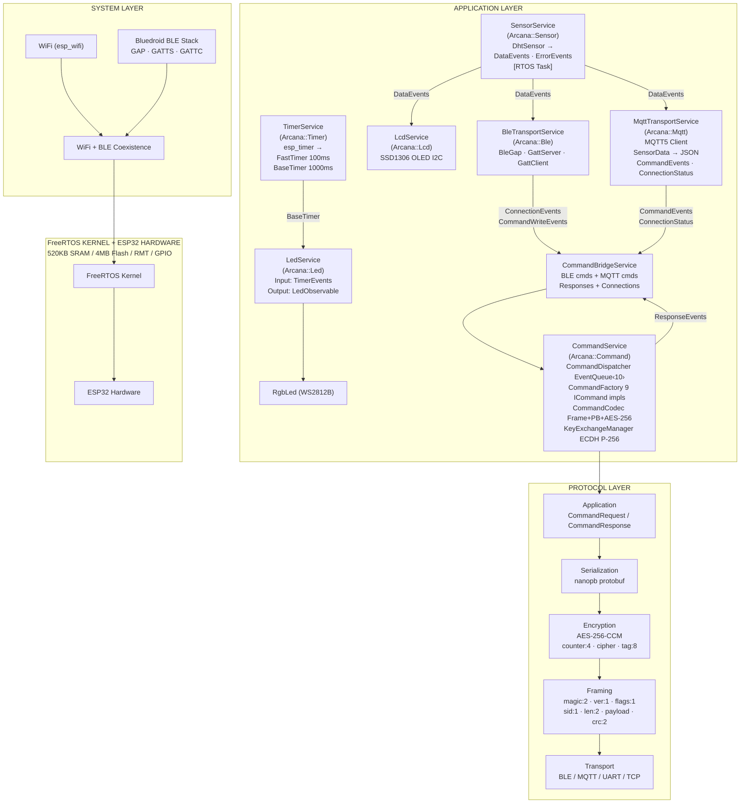

### Component Map

| Component | Namespace | Service | Role |
|-----------|-----------|---------|------|
| `ObservableSensor` | `Arcana::Sensor` | `SensorService` | Observable pattern, sensor base, DHT driver, shared types |
| `BleService` | `Arcana::Ble` | `BleTransportService` | BLE GAP, GATT server/client, transport layer |
| `CommandService` | `Arcana::Command` | `CommandService` | Command pattern with protobuf + AES-256-CCM + ECDH |
| `MqttService` | `Arcana::Mqtt` | `MqttTransportService` | MQTT5 client transport layer |
| `RgbLed` | `Arcana::Led` | `LedService` | WS2812B RGB LED strip via RMT peripheral |
| `OledDisplay` | `Arcana::Lcd` | `LcdService`, `LcdViewModel`, `MainView` | SSD1306 OLED I2C display + MVVM layer |
| `ArcanaTs` | `Arcana::Ats` | — | Time-series DB engine: ChaCha20/AES-CTR, CRC32, pluggable ICipher/IFilePort |
| `AtsStorageService` | `Arcana::Storage` | `AtsStorageService` | Daily `.ats` files on SD card; sensor data + credentials persistence |
| `WifiService` | `Arcana::Wifi` | `WifiService` | WiFi connect + SNTP sync; replaces `protocol_examples_common` |
| `IoService` | `Arcana::Io` | `IoService` | GPIO button state machine (Button A: upload/cancel, Button B: format) |
| `OtaService` | `Arcana` | `OtaService` | A/B OTA: HTTP download → size + CRC-32 verify → slot swap → auto-rollback on boot failure (ESP32-S3 16 MB table) |
| `RegistrationService` | `Arcana::Registration` | `RegistrationService` | TOFU device provisioning: HTTP POST → MQTT credentials stored in device.ats |
| `HttpUploadService` | `Arcana::Upload` | `HttpUploadService` | HTTP upload of pending `.ats` files to server; progress callback |
| `LogService` | `Arcana` | — | Structured logging with ATS/device/serial appenders |
| `main/` | `Arcana` / `Arcana::Timer` | `AppContainer`, `TimerService`, `CommandBridgeService` | App entry, 5-phase lifecycle orchestration, timer, command bridge |

### Component Dependency Graph

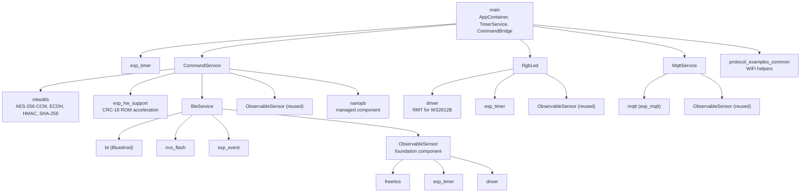

---

## Service Pattern

Every service follows a consistent abstract base / Meyer's singleton implementation pattern:

```cpp
// Abstract base (in component include/)
class XxxService {
public:
    struct Input  { Observable<SomeEvent>* Events = nullptr; };  // dependencies
    struct Output { Observable<MyEvent>*   Data   = nullptr; };  // publications

    Input  input;
    Output output;

    virtual esp_err_t init_HAL() = 0;   // Phase 1: hardware peripherals
    virtual esp_err_t init()     = 0;   // Phase 2: subscriptions + logic
    virtual esp_err_t start()    = 0;   // Phase 3: activate
    virtual void      stop()     = 0;   // Deactivate
};

// Implementation (Meyer's singleton)
class XxxServiceImpl : public XxxService {
public:
    static XxxService& getInstance();   // singleton access
    // ... override all four lifecycle methods
private:
    XxxServiceImpl();                   // allocates output Observables
};
```

### Service Map

| Service | Input | Output | Task Ownership |
|---------|-------|--------|----------------|
| **TimerService** | (none) | `FastTimer` (100ms), `BaseTimer` (1000ms) | `esp_timer` fires at fast rate; counter divider produces base rate |
| **SensorService** | (none) | `DataEvents`, `ErrorEvents`, `Sensor*` | ObservableSensor creates FreeRTOS task |
| **BleTransportService** | `SensorDataEvents` | `ConnectionEvents`, `CommandWriteEvents` | Bluedroid stack tasks |
| **MqttTransportService** | `SensorDataEvents` | `CommandEvents`, `ConnectionStatus` | esp_mqtt_client task |
| **LedService** | `TimerEvents` | `LedObservable` | No own task; timer-driven |
| **LcdService** | (hardware) | display handle | No own task; provides `Ssd1306` to MVVM |
| **LcdViewModel** | `SensorData`, `StorageStats`, `BaseTimer` | `LcdOutput` (dirty-flagged) | No own task; notifies MainView render task |
| **MainView** | `LcdViewModel*`, `Ssd1306*` | (renders to display) | Owns `"LcdView"` FreeRTOS task (2048B, blocks on notify) |
| **CommandService** | `Sensor*` | `ResponseEvents`, `KeyExchangeMgr`, `Factory` | EventQueue creates async task |
| **CommandBridgeService** | 8 fields (BLE+MQTT+Command) | (none) | Purely reactive (subscription callbacks) |
| **WifiService** | (none) | (none; imperative) | esp_wifi internal tasks; `connect()` + `syncNtp()` are synchronous calls |
| **AtsStorageService** | `SensorDataEvents` | `StatsEvents` | Subscription callback writes to SD; `isReady()` for boot sync |
| **IoService** | (GPIO) | (none; polled flags) | Owns GPIO poll task (100ms interval) |
| **RegistrationService** | (none; HTTP) | `Credentials` | Imperative HTTP POST; no own task |
| **HttpUploadService** | (none; HTTP) | (progress callback) | Imperative HTTP upload; progress via callback |
| **OtaService** | (none; HTTP) | (none) | OTA partition write |
| **DiagnosticService** | `TimerEvents` | (logs) | No own task; timer-triggered logging |

### Task Ownership Rule

**ServiceImpl never calls `xTaskCreate`.** Task lifecycle is owned by:

| Task Source | Mechanism | Example |
|-------------|-----------|---------|
| `Observable<T>("name")` | Named constructor creates FreeRTOS task + queue | `"TimerSvc FastTimer"`, `"TimerSvc BaseTimer"`, `"LedSvc Observable"` |
| `EventQueue<T, N>` | `Start()` creates FreeRTOS task | CommandDispatcher async queue |
| `ObservableSensor` | Base class creates sensor reading task | `"sensor_0"` |
| `esp_timer` | ESP-IDF timer task fires callbacks | TimerServiceImpl periodic tick |
| ESP-IDF stacks | Internal tasks | Bluedroid, WiFi, MQTT client |

---

## AppContainer Lifecycle

`AppContainer` (`main/AppContainer.cpp`) is a Meyer's singleton that orchestrates all services through a 5-phase lifecycle, followed by an inline upload-monitor loop:

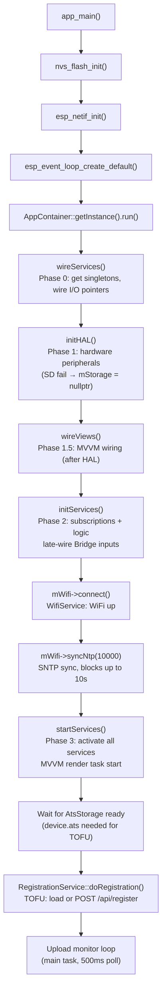

### Phase 0: wireServices()

Gets singleton references and wires Observable I/O pointers between services:

```
mTimer   = &TimerServiceImpl::getInstance()
mSensor  = &SensorServiceImpl::getInstance()
mLed     = &LedServiceImpl::getInstance()
mBle     = &BleTransportServiceImpl::getInstance()
mMqtt    = &MqttTransportServiceImpl::getInstance()
mBridge  = &CommandBridgeServiceImpl::getInstance()
mCommand = &CommandService::Instance()
mStorage = &AtsStorageServiceImpl::getInstance()
mWifi    = &WifiServiceImpl::getInstance()
mIo      = &IoServiceImpl::getInstance()
mOta     = &OtaServiceImpl::getInstance()
mReg     = &RegistrationServiceImpl::getInstance()
mUpload  = &HttpUploadServiceImpl::getInstance()
mDiag    = &DiagnosticServiceImpl::getInstance()

// Wire dependencies via Input structs
mStorage->input.SensorDataEvents = mSensor->output.DataEvents
mLed->input.TimerEvents          = mTimer->output.BaseTimer
mDiag->input.TimerEvents         = mTimer->output.BaseTimer
mBle->input.SensorDataEvents     = mSensor->output.DataEvents
mMqtt->input.SensorDataEvents    = mSensor->output.DataEvents
mCommand->input.Sensor           = mSensor->output.Sensor
```

Output Observables are allocated in constructors, so pointers are valid here. Bridge wiring happens in Phase 2 because it depends on `init()` populating BLE/MQTT/Command output Observables.

### Phase 1: initHAL()

```
mTimer->init_HAL()     // esp_timer_create(periodic callback)
mSensor->init_HAL()    // DhtSensor static instance, output.Sensor = &dht
mBle->init_HAL()       // BleService::Init(), sets output Observable pointers
mLed->init_HAL()       // RgbLed RMT channel setup
mLcd->init_HAL()       // SSD1306 OLED I2C initialization
mMqtt->init_HAL()      // reads Kconfig topic
mStorage->init_HAL()   // SPI SD card mount (FAT32); on failure: mStorage = nullptr
mIo->init_HAL()        // GPIO config for Button A (GPIO5) + Button B (GPIO36)
```

Note: `mStorage->init_HAL()` is not wrapped in `ESP_ERROR_CHECK`. SD failure nulls `mStorage`; system continues without storage.

### Phase 1.5: wireViews()

Called after `initHAL()` so display hardware exists before wiring:

```
sViewModel.input.SensorData    = mSensor->output.DataEvents
sViewModel.input.StorageStats  = mStorage ? mStorage->output.StatsEvents : nullptr
sViewModel.input.BaseTimer     = mTimer->output.BaseTimer

sMainView.input.viewModel  = &sViewModel
sMainView.input.display    = &mLcd->getDisplay()
```

### Phase 2: initServices()

```
mTimer->init()         // computes base divider (base_ms / fast_ms)
mSensor->init()        // subscribes DhtSensor events → service Observables
mBle->init()           // subscribes to SensorDataEvents for GATT notifications
mCommand->init()       // creates KeyExchangeManager, Factory, Dispatcher

// Late wiring: Bridge inputs depend on BLE/MQTT/Command init outputs
mBridge->input.BleConnectionEvents    = mBle->output.ConnectionEvents
mBridge->input.BleCommandWriteEvents  = mBle->output.CommandWriteEvents
mBridge->input.MqttCommandEvents      = mMqtt->output.CommandEvents
mBridge->input.MqttConnectionStatus   = mMqtt->output.ConnectionStatus
mBridge->input.CommandResponseEvents  = mCommand->output.ResponseEvents
mBridge->input.KeyExchangeMgr         = mCommand->output.KeyExchangeMgr
mBridge->input.Factory                = mCommand->output.Factory
mBridge->input.MqttTransport          = mMqtt
mBridge->input.BleServer              = &mBle->server()

mBridge->init()        // subscribes to all event streams
mLed->init()           // subscribes to TimerEvents + own LedObservable
mLcd->init()           // hardware only; no subscriptions (MVVM owns subscriptions)
mMqtt->init()          // subscribes to SensorDataEvents, publishes JSON
mDiag->init()          // subscribes to BaseTimer for periodic logging
mStorage->init()       // semaphore + mutex init (if SD present)
mIo->init()            // GPIO interrupt or poll setup
```

### Phase 3: startServices()

```
mTimer->start()        // esp_timer_start_periodic (100ms)
mSensor->start()       // ObservableSensor FreeRTOS task starts reading
mBle->start()          // BLE advertising begins
mCommand->Start()      // CommandDispatcher async queue task starts
mLed->start()          // sets mRunning=true
mLcd->start()          // sets mRunning=true, shows startup screen
mMqtt->start()         // MQTT5 client connects to broker
mDiag->start()         // diagnostic logging begins
mStorage->start()      // ATS write task starts (if SD present)
mIo->start()           // GPIO poll task starts (100ms interval)

sMainView.start()      // LcdView render task created
sViewModel.init(sMainView.taskHandle())  // ViewModel subscribes, notifies render task
```

---

## Data Flow

### Timer -> LED Cycling

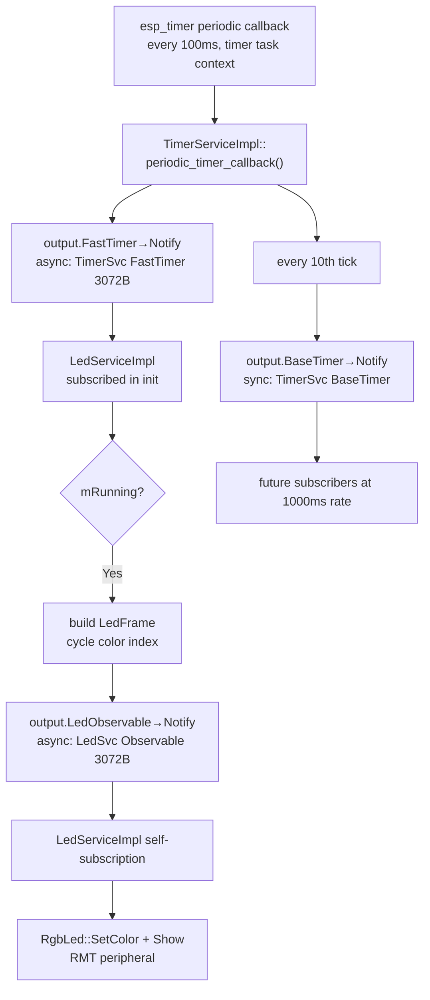

### Sensor -> BLE + LCD + MQTT + Storage (Fan-out)

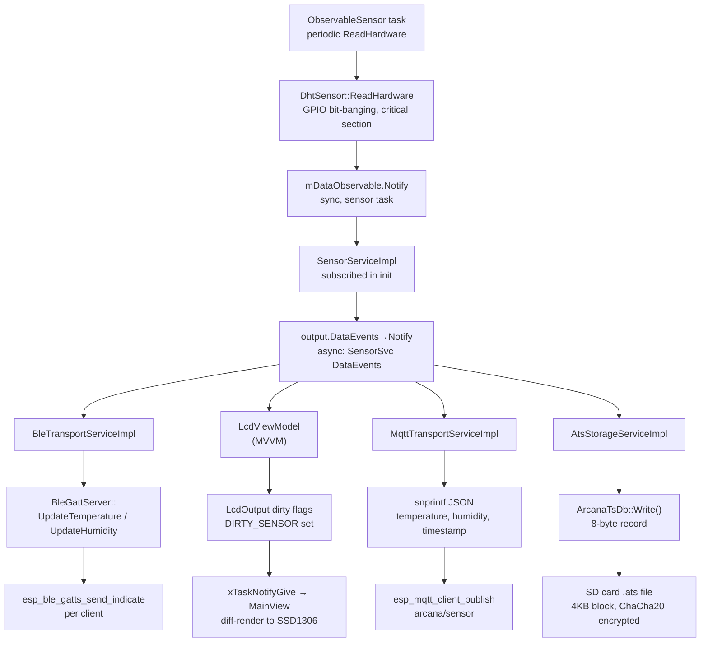

### BLE Command -> Response

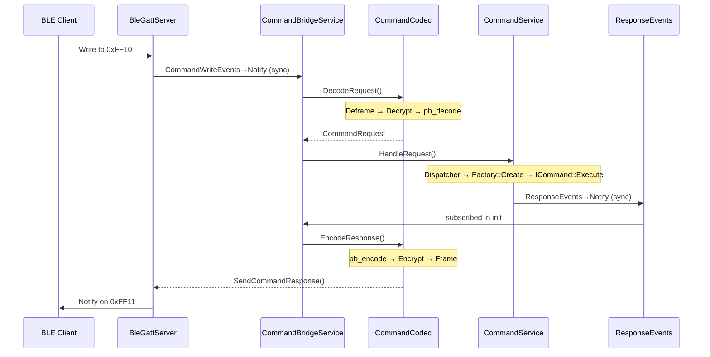

### MQTT Command -> Response

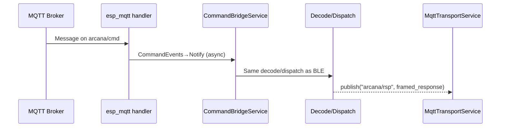

### BLE Disconnect -> Session Cleanup

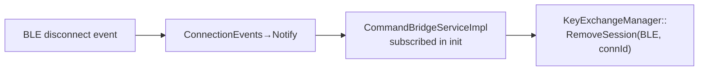

---

## Arcana Frame Protocol

Every Arcana packet -- whether plaintext or encrypted -- is wrapped in a Frame for transport integrity.

### Wire Layout

```
Offset:  0     1     2     3     4     5     6     7        7+N   7+N+1
       +-----+-----+-----+-----+-----+-----+-----+--------+-----+-----+
       | 0xAC| 0xDA| 0x01| Flg | SID |  Length LE | Payload|  CRC-16 LE|
       +-----+-----+-----+-----+-----+-----+-----+--------+-----+-----+
       |<- Magic ->| Ver |     |     |<-- 2B  -->|<- N B ->|<-- 2B  -->|
       |                                                    |
       |<----------------- CRC-16 covers ------------------>|
```

| Field | Offset | Size | Value | Description |
|-------|--------|------|-------|-------------|
| **Magic** | 0 | 2 | `0xAC 0xDA` | "Arcana Data" identifier |
| **Version** | 2 | 1 | `0x01` | Protocol version (v1) |
| **Flags** | 3 | 1 | bitfield | Bit 0: FIN (last frame in stream); bits 1-7 reserved (must be 0) |
| **Stream ID** | 4 | 1 | `0x00-0xFF` | Stream identifier for request-response correlation |
| **Length** | 5 | 2 | LE uint16 | Payload length (excludes header and CRC) |
| **Payload** | 7 | N | -- | Encrypted: `[counter:4][cipher][tag:8]`; Plaintext: raw protobuf |
| **CRC-16** | 7+N | 2 | LE uint16 | `esp_crc16_le(0, magic..payload)` (hardware-accelerated on ESP32) |

- **Header**: 7 bytes (Magic + Version + Flags + Stream ID + Length)
- **Trailer**: 2 bytes (CRC-16)
- **Total overhead**: 9 bytes
- **CRC scope**: Magic through end of Payload (excludes the CRC itself)

### Stream ID Ranges

| Range | Usage |
|-------|-------|
| `0x00` | One-shot (no stream, default) |
| `0x01-0x7F` | Client-initiated (client assigns, server echoes) |
| `0x80-0xFE` | Server-initiated push |
| `0xFF` | Reserved |

### Stream Lifecycle

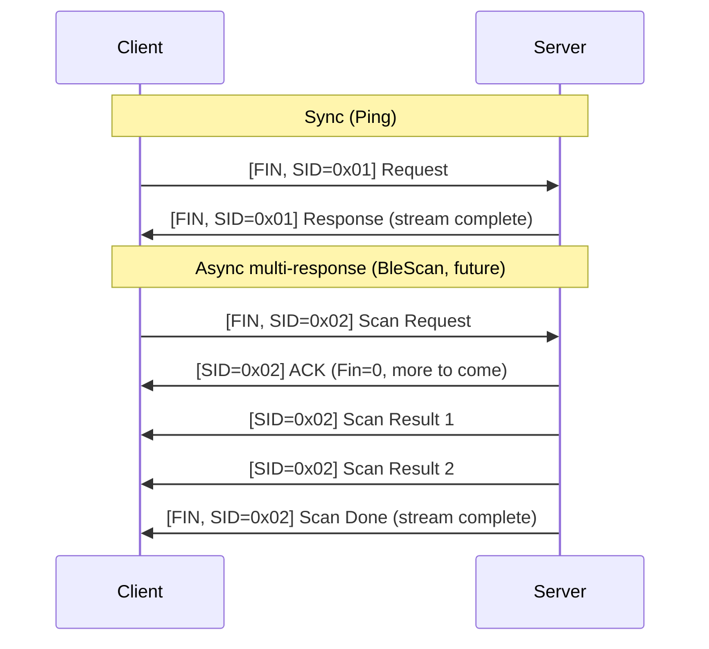

### Max Wire Sizes

| Direction | Protobuf Max | + Crypto (12B) | + Frame (9B) | Total |
|-----------|-------------|----------------|--------------|-------|
| Request   | 143 B       | 155 B          | **164 B**    | 164 B |
| Response  | 277 B       | 289 B          | **298 B**    | 298 B |

### FrameCodec API

```cpp
namespace Arcana::Command {

class FrameCodec {
public:
    static constexpr uint8_t  kMagic[2] = {0xAC, 0xDA};
    static constexpr uint8_t  kVersion  = 0x01;
    static constexpr size_t   kOverhead = 9;   // 7 header + 2 CRC
    static constexpr uint8_t  kFlagFin  = 0x01;
    static constexpr uint8_t  kSidNone  = 0x00;

    // Wrap payload into frame (flags defaults to FIN, streamId defaults to 0)
    static bool Frame(const uint8_t* payload, size_t payloadLen,
                      uint8_t* out, size_t outBufSize, size_t& outLen,
                      uint8_t flags = kFlagFin, uint8_t streamId = kSidNone);

    // Unwrap frame, verify magic + version + CRC, return payload + flags + streamId
    static bool Deframe(const uint8_t* frame, size_t frameLen,
                        const uint8_t*& payload, size_t& payloadLen,
                        uint8_t& flags, uint8_t& streamId);
};

}
```

---

## Command Protocol

### Overview

The CommandService provides a **unified binary command pipeline** shared by BLE and MQTT. Both channels use identical framed protobuf wire format with optional AES-256-CCM encryption.

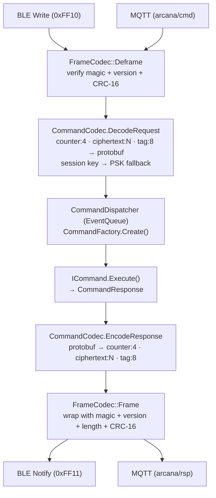

### Cluster + Command Dispatch

Commands follow a **Matter/ZCL-style two-layer dispatch**: a `Cluster` identifies the domain, and a `Command` ID selects the operation within that cluster.

| Cluster | ID | Command | ID | Type | Description |
|---------|----|---------|----|------|-------------|
| **System** | `0x00` | Ping | `0x01` | Sync | Returns timestamp (microseconds since boot) |
| | | GetDeviceInfo | `0x02` | Sync | Chip model, IDF version, free heap, MAC |
| **Sensor** | `0x01` | GetData | `0x01` | Sync | Current temperature + humidity |
| | | SetNotifyInterval | `0x02` | Sync | Change sensor polling interval (ms) |
| **Ble** | `0x02` | GetStatus | `0x01` | Sync | Connected clients, advertising state |
| | | SetDeviceName | `0x02` | Sync | Update BLE device name (persisted to NVS) |
| | | Scan | `0x03` | **Async** | Trigger BLE scan, results via response stream |
| **Mqtt** | `0x03` | GetStatus | `0x01` | Sync | MQTT connection state |
| **Security** | `0x04` | KeyExchange | `0x01` | Sync | ECDH P-256 key exchange (requires encryption) |
| **Ota** | `0x05` | StartUpdate | `0x01` | **Async** | Begin firmware update (host/port/path/size/crc32); runs in background task, ends in reset |
| | | GetProgress | `0x02` | Sync | Poll update state: `{active, percent}` |

### Status Codes

| Code | Name | Description |
|------|------|-------------|
| `0x00` | OK | Success |
| `0x01` | UnknownCommand | Cluster or command not recognized |
| `0x02` | InvalidParam | Payload validation failed |
| `0x03` | Busy | Resource busy (e.g., scan in progress) |
| `0xFF` | Error | Generic error |

### Wire Format (Protobuf)

```protobuf
// arcana_cmd.proto
message CmdRequest {
  uint32 cluster = 1;    // Cluster domain (System=0, Sensor=1, Ble=2, Mqtt=3, Security=4)
  uint32 command = 2;    // Command ID within cluster
  bytes  payload = 3;    // max 128 bytes
}

message CmdResponse {
  uint32 cluster = 1;    // Cluster domain (echo)
  uint32 command = 2;    // Command ID (echo)
  uint32 status  = 3;    // 0 = OK
  bytes  payload = 4;    // max 256 bytes
}
```

### Complete Wire Encoding

```
Plaintext:   Frame( protobuf_bytes )
Encrypted:   Frame( [counter:4 LE][AES-CCM(protobuf_bytes)][tag:8] )
```

---

## Protocol Samples

### Sample 1: Plaintext Ping Request

System::Ping -- cluster=0x00, command=0x01, no payload.

**Protobuf encoding** (4 bytes):
```
08 00        <- field 1 (cluster) varint = 0x00
10 01        <- field 2 (command) varint = 0x01
             <- field 3 (payload) omitted (empty)
```

**Framed wire** (13 bytes):
```
Offset  Hex                          Description
------  ---------------------------  -----------
 0-1    AC DA                        Magic "Arcana Data"
 2      01                           Version 1
 3      01                           Flags (FIN=1)
 4      00                           Stream ID (0 = one-shot)
 5-6    04 00                        Length = 4 (LE)
 7-10   08 00 10 01                  Payload (protobuf)
 11-12  xx xx                        CRC-16 (LE, computed over bytes 0..10)
```

### Sample 2: Encrypted Ping Request

Same Ping request, but with AES-256-CCM encryption enabled.

**Inner protobuf** (4 bytes): `08 00 10 01`

**Encrypted payload** (16 bytes = 4 counter + 4 ciphertext + 8 tag):
```
01 00 00 00        <- TX counter = 1 (LE uint32)
xx xx xx xx        <- AES-256-CCM ciphertext (4 bytes, same length as plaintext)
xx xx xx xx        <- Authentication tag (8 bytes)
xx xx xx xx
```

**Framed wire** (25 bytes):
```
Offset  Hex                                            Description
------  ---------------------------------------------  -----------
 0-1    AC DA                                          Magic
 2      01                                             Version 1
 3      01                                             Flags (FIN=1)
 4      00                                             Stream ID (0 = one-shot)
 5-6    10 00                                          Length = 16 (LE)
 7-10   01 00 00 00                                    Counter (LE)
 11-14  xx xx xx xx                                    Ciphertext
 15-22  xx xx xx xx xx xx xx xx                        Auth tag (8B)
 23-24  xx xx                                          CRC-16 (LE)
```

### Sample 3: Security::KeyExchange Request (Encrypted with PSK)

The KeyExchange request carries a 64-byte P-256 public key, encrypted with PSK.

**Inner protobuf** (~69 bytes):
```
08 04              <- cluster = 0x04 (Security)
10 01              <- command = 0x01 (KeyExchange)
1A 40 ...          <- payload = 64 bytes (client public key: X||Y)
```

**Encrypted payload** (~81 bytes = 4 counter + ~69 ciphertext + 8 tag)

**Framed wire** (~90 bytes):
```
AC DA 01 01 00 51 00  Magic + Version + Flags(FIN) + SID(0) + Length=81 (LE)
[encrypted_payload: 81 bytes]
xx xx                 CRC-16 (LE)
```

### Decode/Encode Flow Summary

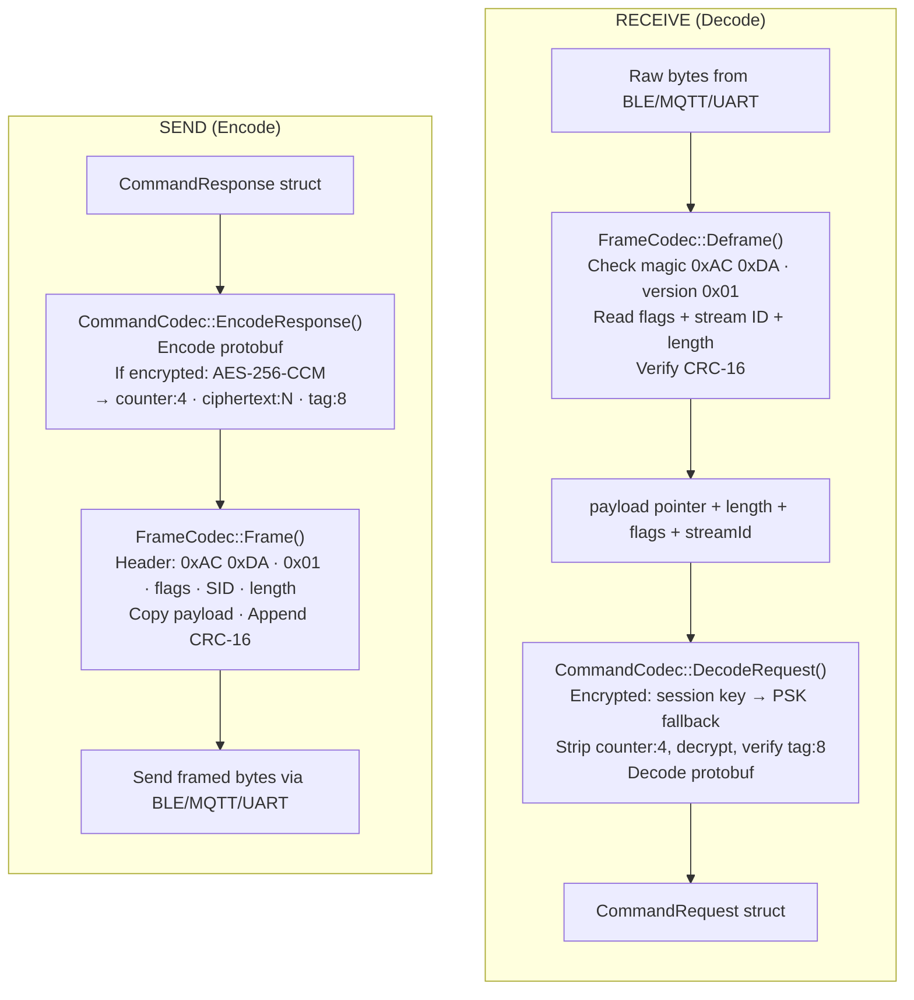

---

## Security

### Encryption (AES-256-CCM)

Optional, enabled via `CMD_ENCRYPTION_ENABLED=y` in Kconfig.

| Parameter | Value |
|-----------|-------|
| Algorithm | AES-256-CCM (via mbedtls) |
| Key size | 256-bit (32 bytes) |
| Auth tag | 8 bytes |
| Nonce | 13 bytes (9-byte SHA-256 derived prefix + 4-byte LE counter) |
| Wire overhead | 12 bytes (4B counter + 8B tag) |
| PSK config | `CMD_ENCRYPTION_PSK` (64 hex chars) |

### ECDH P-256 Key Exchange

Provides **Perfect Forward Secrecy** -- per-connection session keys are derived independently from the PSK. If the PSK is compromised, past session traffic remains protected.

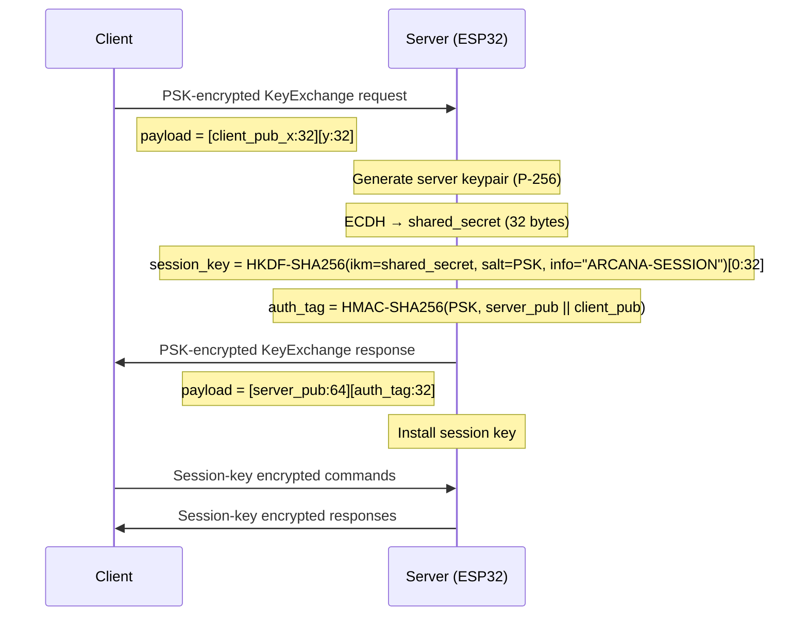

### Session Management

| Property | Value |
|----------|-------|
| Max concurrent sessions | 4 (3 BLE + 1 MQTT) |
| Session key derivation | HKDF-SHA256 (manual impl, MBEDTLS_HKDF_C not available) |
| Auth tag | HMAC-SHA256(PSK, server_pub \|\| client_pub) -- 32 bytes |
| Decrypt fallback | Session key first, then PSK (allows pre-KeyExchange commands) |
| KeyExchange response | Always PSK-encrypted (session installed after send) |
| BLE disconnect | Session automatically removed via ConnectionEvents subscription |
| Thread safety | FreeRTOS mutex protects session table across BLE/MQTT tasks |

### Integrity Protection by Mode

| Mode | Encryption Auth | Frame CRC-16 | Protection Level |
|------|----------------|--------------|------------------|
| Plaintext | None | Yes | Corruption detection |
| PSK Encrypted | AES-CCM tag (8B) | Yes | Tampering + corruption |
| Session Encrypted | AES-CCM tag (8B) | Yes | Tampering + corruption + PFS |

---

## BLE Dual-Role

### GATT Server -- Environmental Sensing (0x181A)

| Characteristic | UUID | Properties | Format |
|---------------|------|------------|--------|
| Temperature | 0x2A6E | Read + Notify | `int16_t` (Celsius * 100) |
| Humidity | 0x2A6F | Read + Notify | `uint16_t` (% * 100) |
| Sensor Status | 0xFF01 | Read | `uint8_t` |
| Command | 0xFF10 | Write | Binary (framed protobuf or encrypted) |
| Response | 0xFF11 | Notify | Binary (framed protobuf or encrypted) |

**Features:**
- Attribute table approach (`esp_ble_gatts_create_attr_tab`), 14 attributes total
- Up to 3 simultaneous client connections with per-client CCCD tracking
- Automatic re-advertising after client disconnect
- Observable for connection events and command writes

### GATT Client -- Remote Sensor Discovery


### GAP -- Advertising & Scanning

| Parameter | Value |
|-----------|-------|
| ADV Type | `ADV_TYPE_IND` (connectable undirected) |
| ADV Interval | 20-40 ms |
| Scan Type | Active |
| Scan Interval / Window | 50 ms / 30 ms |
| Device Name | `ARCANA-ESP32` (configurable via Kconfig) |
| Appearance | Generic Sensor (0x0540) |

### BLE + WiFi Coexistence

Both WiFi and BLE run simultaneously via ESP-IDF's software coexistence manager (`CONFIG_ESP_COEX_SW_COEXIST_ENABLE`). The MQTT5 client operates over WiFi while BLE handles local sensor communication.

---

## Observable Pattern

### Construction Modes

| Mode | Constructor | Dispatch | Task Created? |
|------|-------------|----------|---------------|
| **Synchronous** | `Observable<T>()` | In caller's thread | No |
| **Asynchronous** | `Observable<T>("name")` | Dedicated FreeRTOS task + queue | Yes |

Asynchronous mode is used for all service-level Observables (decouples producers from consumers). Synchronous mode is used for hardware-level callbacks within components.

### Variants

| Variant | Heap | Callback Type | Max Subscribers | Use Case |
|---------|------|---------------|-----------------|----------|
| `Observable<T>` | Yes | `std::function` | Unlimited | General use |
| `Observable<T, N>` | Yes | `std::function` | N (compile-time) | Bounded resources |
| `StaticObservable<T, N>` | No | Function pointer | N (compile-time) | Memory-constrained |

### Utilities

| Utility | Purpose |
|---------|---------|
| `Subscription<T>` | RAII guard, auto-unsubscribes on destruction |
| `EventQueue<T, N>` | Standalone FreeRTOS queue + task (used by CommandDispatcher) |
| `WeakObserver<T, Owner>` | Wraps `std::weak_ptr`, skips expired observers |
| `Subject<Events...>` | Variadic base for components emitting multiple event types |

### Event Hierarchy (SensorTypes)

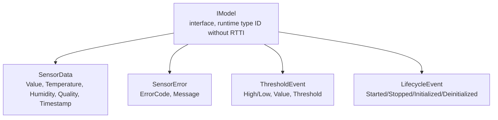

---

## Task Architecture

| Task | Stack | Priority | Owner | Created By |
|------|-------|----------|-------|------------|
| `"TimerSvc FastTimer"` | 3072 | 5 | Observable | TimerServiceImpl constructor |
| `"TimerSvc BaseTimer"` | 2048 | 5 | Observable | TimerServiceImpl constructor |
| `"sensor_0"` | 4096 (Kconfig) | 5 | ObservableSensor | ObservableSensor::Start() |
| `"SensorSvc DataEvents"` | 2048 | 5 | Observable | SensorServiceImpl constructor |
| `"SensorSvc ErrorEvents"` | 2048 | 5 | Observable | SensorServiceImpl constructor |
| `"LedSvc Observable"` | 3072 | 5 | Observable | LedServiceImpl constructor |
| `"MqttSvc CommandEvents"` | 2048 | 5 | Observable | MqttTransportServiceImpl constructor |
| `"MqttSvc ConnStatus"` | 2048 | 5 | Observable | MqttTransportServiceImpl constructor |
| `"LcdView"` | 2048 | 2 | MainView | `MainView::start()` |
| IoService poll task | 2048 (est) | 5 | IoServiceImpl | `IoServiceImpl::start()` |
| CommandDispatcher | 4096 (Kconfig) | 5 | EventQueue | CommandService::Start() |
| BT Controller | (internal) | High | Bluedroid | BleService::Init() |
| BT Host | (internal) | High | Bluedroid | BleService::Init() |
| WiFi | (internal) | -- | esp_wifi | WifiServiceImpl::connect() |
| MQTT Client | (internal) | -- | esp_mqtt | MqttTransportService::start() |
| esp_timer | (internal) | 22 | esp_timer | System startup |
| main task | 4096 (app_main default) | 1 | AppContainer | app_main (upload monitor loop) |

---

## Supported Boards

The firmware targets two boards from one codebase. CMake selects the board
implementation by `IDF_TARGET`; all platform-independent logic lives in
`main/share/` and each board contributes a `BoardConfig.hpp` + `Board.cpp`
factory (display + sensor) plus any board-only HAL drivers.

| | **ESP32 DevKit** (classic) | **ALIENTEK DNESP32S3** |
|---|---|---|
| Target | `esp32` (Xtensa LX6, dual-core) | `esp32s3` (Xtensa LX7, dual-core) |
| Module | ESP32-WROOM | ESP32-S3-WROOM-1 **N16R8** |
| Flash / PSRAM | 4 MB / — | 16 MB / 8 MB Octal PSRAM |
| Display | SSD1306 OLED (I²C, 128×64) | ST7789 SPI LCD (320×240, SPILCD socket) |
| Environment sensor | DHT11/DHT22 (GPIO15) | S3 internal die-temperature sensor¹ |
| IO expander | — | XL9555 (16-bit, I²C0) — keys, LCD/camera power, beeper |
| SD card | SDSPI (CLK4/MOSI32/MISO17/CS27 @ 4 MHz) | SDSPI onboard TF slot (CLK12/MOSI11/MISO13/CS2 @ 20 MHz, ~1.1 MB/s) |
| Buttons | A=GPIO5, B=GPIO36 | A disabled², B=BOOT key (IO0) |
| Partition table | 4 MB factory-only | 16 MB **A/B OTA** (ota_0/ota_1 + 7.9 MB FAT) |
| Flash/monitor | external USB-UART | native USB-C (USB-Serial-JTAG) or CH340 |

¹ The DNESP32S3 has no wirable ambient temp/humidity sensor — the U4 DHT
socket only reaches the LCD DC line or the BOOT key — so the sensor pipeline
is fed by the chip's internal temperature sensor (reads above ambient).
² KEY0–3 sit behind the XL9555 expander; GPIO5 is the camera's D1 line.

Full DNESP32S3 pin map, mux-conflict matrix, OV5640 camera and ESP-Prog-2
notes: [`docs/DNESP32S3-pinmap.md`](docs/DNESP32S3-pinmap.md).

## Getting Started

### Prerequisites

- [ESP-IDF v6.0.1+](https://docs.espressif.com/projects/esp-idf/en/latest/esp32/get-started/)
- An ESP32 or ESP32-S3 development board (see [Supported Boards](#supported-boards))

### Build & Flash

```bash
git clone https://github.com/jrjohn/arcana-embedded-esp32.git
cd arcana-embedded-esp32

# Set up ESP-IDF environment
source ~/.espressif/v6.0.1/esp-idf/export.sh

# Configure credentials (required on first clone)
cp sdkconfig.credentials.example sdkconfig.credentials
# Edit sdkconfig.credentials with your Wi-Fi and MQTT settings

# --- Classic ESP32 DevKit ---
idf.py set-target esp32          # default; sdkconfig.defaults applies
idf.py build
idf.py -p /dev/ttyUSB0 flash monitor

# --- ALIENTEK DNESP32S3 ---
idf.py set-target esp32s3        # picks up sdkconfig.defaults.esp32s3 + board dir
idf.py build
idf.py -p /dev/cu.usbmodem* flash monitor   # native USB-C

# NOTE: switching the OTA partition layout (esp32 <-> esp32s3) requires a
# one-time `idf.py erase-flash` so stale NVS/app data does not linger.
```

Per-board pin assignments, flash size and PSRAM come from `IDF_TARGET`-gated
Kconfig defaults and `sdkconfig.defaults.<target>` — no manual menuconfig
needed to switch boards.

### Credentials

Wi-Fi and MQTT broker settings are stored in `sdkconfig.credentials` which is **gitignored**.

| File | Purpose | Git |
|------|---------|-----|
| `sdkconfig.defaults` | Base config (BT, partition, etc.) | Committed |
| `sdkconfig.credentials.example` | Template for credentials | Committed |
| `sdkconfig.credentials` | **Your Wi-Fi SSID/password, MQTT broker IP** | **Gitignored** |
| `sdkconfig` | Full generated config (build output) | Gitignored |

`CMakeLists.txt` loads `sdkconfig.defaults` then overlays `sdkconfig.credentials` automatically. Values in credentials override the placeholder defaults in Kconfig.

### Configuration

```bash
idf.py menuconfig
```

| Menu | Option | Default |
|------|--------|---------|
| **Arcana Timer** | Fast Interval | 100 ms |
| | Base Interval | 1000 ms |
| **RGB LED** | GPIO Pin | 26 |
| | Number of LEDs | 3 |
| | Cycle Interval | 1000 ms |
| **Observable Sensor** | DHT Type | DHT11 |
| | GPIO Pin | 15 (esp32) / -1 disabled (esp32s3 uses internal tsens) |
| | Read Interval | (Kconfig) |
| **ATS Storage** | SD SPI pins | per-target (esp32: 4/32/17/27 · esp32s3: 12/11/13/2) |
| | SD SPI max freq | 4 MHz (esp32) / 20 MHz (esp32s3) |
| | Boot benchmark | OFF |
| **BLE Service** | Device Name | `ARCANA-ESP32S3` |
| | Max Connections | 3 |
| **Command Service** | Encryption (AES-256-CCM) | OFF |
| | PSK (64 hex chars) | `0011...EEFF` |
| **MQTT Service** | Cmd Topic | `arcana/cmd` |
| | Rsp Topic | `arcana/rsp` |
| **MQTT Configuration** | Broker URL | (via `sdkconfig.credentials`) |
| **WiFi** | SSID / Password | (via `sdkconfig.credentials`) |

---

## Project Structure

```
arcana-embedded-esp32/
+-- components/
|   +-- ObservableSensor/            # Foundation: Observable, sensor, shared types
|   |   +-- include/
|   |   |   +-- Observable.hpp           # Observable<T,N>, EventQueue, StaticObservable
|   |   |   +-- ObservableSensor.hpp     # Sensor base with RTOS task
|   |   |   +-- SensorTypes.hpp          # IModel, SensorData, std::variant events
|   |   |   +-- SensorService.hpp        # Abstract service base
|   |   |   +-- SensorServiceImpl.hpp    # Meyer's singleton impl
|   |   |   +-- DhtSensor.hpp            # DHT11/DHT22 GPIO bit-bang driver
|   |   |   +-- TimerTypes.hpp           # TimerTick struct (shared)
|   |   +-- ObservableSensor.cpp
|   |   +-- SensorServiceImpl.cpp
|   |   +-- DhtSensor.cpp
|   |   +-- CMakeLists.txt / Kconfig
|   |
|   +-- BleService/                  # BLE dual-role transport
|   |   +-- include/
|   |   |   +-- BleService.hpp           # BLE facade
|   |   |   +-- BleTransportService.hpp  # Abstract service base
|   |   |   +-- BleTransportServiceImpl.hpp
|   |   |   +-- BleGattServer.hpp        # GATT Server (Env Sensing + Command)
|   |   |   +-- BleGattClient.hpp        # GATT Client (scan + connect)
|   |   |   +-- BleGap.hpp              # GAP advertising + scanning
|   |   |   +-- BleTypes.hpp / BleUuids.hpp
|   |   +-- src/
|   |   |   +-- BleService.cpp / BleTransportServiceImpl.cpp
|   |   |   +-- BleGattServer.cpp / BleGattClient.cpp / BleGap.cpp
|   |   +-- CMakeLists.txt / Kconfig
|   |
|   +-- CommandService/              # Command pipeline + crypto
|   |   +-- include/
|   |   |   +-- CommandService.hpp       # Singleton facade
|   |   |   +-- CommandDispatcher.hpp    # EventQueue async dispatch
|   |   |   +-- CommandFactory.hpp       # Cluster+Command -> ICommand
|   |   |   +-- CommandTypes.hpp         # Enums, Request/Response structs
|   |   |   +-- CommandCodec.hpp         # Protobuf + AES-256-CCM codec
|   |   |   +-- FrameCodec.hpp          # Frame/Deframe: magic + ver + CRC-16
|   |   |   +-- CryptoEngine.hpp        # AES-256-CCM encrypt/decrypt
|   |   |   +-- KeyExchangeManager.hpp  # ECDH P-256, session management
|   |   |   +-- ICommand.hpp            # Command interface
|   |   |   +-- commands/               # 9 ICommand implementations
|   |   +-- src/
|   |   |   +-- CommandService.cpp / CommandFactory.cpp / CommandDispatcher.cpp
|   |   |   +-- CommandCodec.cpp / CryptoEngine.cpp / KeyExchangeManager.cpp
|   |   |   +-- arcana_cmd.pb.c         # nanopb generated
|   |   +-- proto/
|   |   |   +-- arcana_cmd.proto / arcana_cmd.options
|   |   +-- CMakeLists.txt / Kconfig / idf_component.yml
|   |
|   +-- MqttService/                 # MQTT5 transport
|   |   +-- include/
|   |   |   +-- MqttTransportService.hpp
|   |   |   +-- MqttTransportServiceImpl.hpp
|   |   +-- MqttTransportServiceImpl.cpp
|   |   +-- CMakeLists.txt / Kconfig
|   |
|   +-- RgbLed/                      # WS2812B LED strip via RMT
|   |   +-- include/
|   |   |   +-- RgbLed.hpp               # RMT driver
|   |   |   +-- LedService.hpp           # Abstract service base
|   |   |   +-- LedServiceImpl.hpp       # Meyer's singleton impl
|   |   +-- RgbLed.cpp / LedServiceImpl.cpp
|   |   +-- CMakeLists.txt / Kconfig
|   |
|   +-- ArcanaTs/                    # Time-series DB engine
|   |   +-- include/
|   |   |   +-- ats/ArcanaTsDb.hpp        # Core DB: append, query, rotate
|   |   |   +-- ats/ICipher.hpp / IMutex.hpp / IFilePort.hpp  # Interfaces
|   |   |   +-- ChaCha20.hpp / ChaCha20Cipher.hpp / NullCipher.hpp
|   |   |   +-- Esp32AesCtrCipher.hpp / FreeRtosMutex.hpp / VfsFilePort.hpp
|   |   +-- src/ (ArcanaTsDb.cpp, VfsFilePort.cpp)
|   |   +-- CMakeLists.txt
|   |
|   +-- AtsStorageService/           # SD card time-series storage
|   |   +-- include/
|   |   |   +-- AtsStorageService.hpp        # Abstract base
|   |   |   +-- impl/AtsStorageServiceImpl.hpp
|   |   +-- CMakeLists.txt
|   |
|   +-- WifiService/                 # WiFi + SNTP
|   |   +-- include/
|   |   |   +-- WifiService.hpp / impl/WifiServiceImpl.hpp
|   |   +-- WifiServiceImpl.cpp / CMakeLists.txt
|   |
|   +-- IoService/                   # GPIO button service
|   |   +-- include/
|   |   |   +-- IoService.hpp / impl/IoServiceImpl.hpp
|   |   +-- CMakeLists.txt
|   |
|   +-- OtaService/                  # OTA firmware update
|   |   +-- include/OtaService.hpp / impl/OtaServiceImpl.hpp
|   |   +-- OtaServiceImpl.cpp / CMakeLists.txt
|   |
|   +-- RegistrationService/         # TOFU device provisioning
|   |   +-- include/
|   |   |   +-- RegistrationService.hpp / impl/RegistrationServiceImpl.hpp
|   |   +-- CMakeLists.txt
|   |
|   +-- HttpUploadService/           # HTTP file upload
|   |   +-- include/
|   |   |   +-- HttpUploadService.hpp / impl/HttpUploadServiceImpl.hpp
|   |   +-- CMakeLists.txt
|   |
|   +-- LogService/                  # Structured logging (ATS + serial appenders)
|       +-- include/ (Log.hpp, EventCodes.hpp, AtsAppender.hpp, ...)
|       +-- CMakeLists.txt
|
+-- main/
|   +-- app_main.cpp                     # Entry: NVS + netif + event loop + AppContainer::run()
|   +-- AppContainer.hpp / AppContainer.cpp  # 5-phase lifecycle orchestration
|   +-- TimerService.hpp                 # Abstract base (esp_timer periodic ticks)
|   +-- impl/TimerServiceImpl.hpp / .cpp # Meyer's singleton impl
|   +-- CommandBridgeService.hpp         # Abstract base (glue service)
|   +-- impl/CommandBridgeServiceImpl.hpp / .cpp
|   +-- DiagnosticService.hpp / impl/DiagnosticServiceImpl.hpp / .cpp
|   +-- CMakeLists.txt / Kconfig.projbuild / idf_component.yml
|
+-- partitions.csv                       # Custom partition table (~4MB app)
+-- sdkconfig.defaults                   # Base config (committed)
+-- sdkconfig.credentials.example        # Credentials template (committed)
+-- sdkconfig.credentials                # Your Wi-Fi/MQTT secrets (gitignored)
+-- sdkconfig                            # Generated full config (gitignored)
+-- CMakeLists.txt                       # Project config (MINIMAL_BUILD)
+-- README.md
```

---

## Adding a New Command

```cpp
// 1. Add command ID to the appropriate cluster namespace in CommandTypes.hpp
namespace SensorCmd {
    static constexpr uint8_t GetData           = 0x01;
    static constexpr uint8_t SetNotifyInterval = 0x02;
    static constexpr uint8_t Calibrate         = 0x03;  // NEW
}

// 2. Create header-only command
class CalibrateCommand : public ICommand {
public:
    CommandResponse Execute(const CommandRequest& req) override {
        CommandResponse rsp;
        rsp.Source = req.Source;
        rsp.ConnectionId = req.ConnectionId;
        rsp.ClusterId = Cluster::Sensor;
        rsp.Command = SensorCmd::Calibrate;
        rsp.Status = kStatusOk;
        // Fill rsp.Payload...
        return rsp;
    }
};

// 3. Add to CommandFactory::Create() switch
case Cluster::Sensor:
    switch (cmd) {
    case SensorCmd::Calibrate:
        return std::make_unique<CalibrateCommand>();
    // ...
    }
```

---

## Verification

1. **Build**: `idf.py build`
2. **LED Cycling**: 3 WS2812B LEDs cycle colors at 100ms intervals via FastTimer (timer-driven)
3. **BLE Sensor**: Use nRF Connect to scan for `ARCANA-ESP32`, subscribe to Temperature/Humidity notifications
4. **BLE Command**: Write framed binary to 0xFF10, receive framed response on 0xFF11
5. **MQTT Command**: Publish framed binary to `arcana/cmd`, subscribe to `arcana/rsp`
6. **Frame Validation**: Send garbage bytes (wrong magic / bad CRC), verify `FrameCodec::Deframe` rejects
7. **Encryption**: Enable `CMD_ENCRYPTION_ENABLED`, verify PSK-encrypted round-trip
8. **Key Exchange**: Send KeyExchange (Security/0x01) with client P-256 public key, verify session-encrypted subsequent commands
9. **Session Cleanup**: Disconnect BLE, verify session removed, next command falls back to PSK
10. **No task leaks**: `grep -r xTaskCreate components/RgbLed/` returns nothing

---

## Roadmap

- [x] Type-safe Observable template (dynamic + static + async)
- [x] RAII Subscription guard + WeakObserver
- [x] IModel polymorphic events + std::variant alternative
- [x] EventQueue async dispatch
- [x] **Service pattern (abstract base + Input/Output + 5-phase lifecycle)**
- [x] **AppContainer orchestration (wire -> initHAL -> wireViews -> init -> start)**
- [x] **TimerService (esp_timer periodic ticks via Observable)**
- [x] BLE GATT Server (Environmental Sensing 0x181A)
- [x] BLE GATT Client (scan + connect + notify)
- [x] WiFi + BLE coexistence
- [x] ObservableSensor -> BLE bridge
- [x] **Unified Command Pipeline (BLE + MQTT)**
- [x] **nanopb Protobuf wire format**
- [x] **AES-256-CCM encryption**
- [x] **ECDH P-256 key exchange (Perfect Forward Secrecy)**
- [x] **Per-connection session keys (4 slots)**
- [x] **Frame Protocol (magic + version + flags + stream ID + CRC-16)**
- [x] **RGB LED service (timer-driven, no own task)**
- [x] **MVVM display layer (LcdViewModel + MainView, dirty-flag diffing)**
- [x] **WifiService (encapsulated WiFi + SNTP, no protocol_examples_common)**
- [x] **ArcanaTs time-series DB (ChaCha20 encrypted, CRC32, daily rotation)**
- [x] **AtsStorageService (SD card sensor data, graceful degradation)**
- [x] **IoService (GPIO buttons: upload trigger, cancel, SD format)**
- [x] **RegistrationService (TOFU device provisioning)**
- [x] **HttpUploadService (upload .ats files, progress callback)**
- [x] **OTA firmware update**
- [ ] UART transport (frame layer ready)
- [ ] BLE bonding & SMP pairing
- [ ] Real hardware sensor driver (I2C/SPI)
- [ ] Runtime statistics dashboard
- [ ] Unit tests (component-level, host-based)

---

## Contributing

Contributions are welcome! Please feel free to submit a Pull Request.

1. Fork the repository
2. Create your feature branch (`git checkout -b feature/AmazingFeature`)
3. Commit your changes (`git commit -m 'Add some AmazingFeature'`)
4. Push to the branch (`git push origin feature/AmazingFeature`)
5. Open a Pull Request

---

## License

This project is licensed under the MIT License - see the [LICENSE](LICENSE) file for details.

---

## Acknowledgments

- Inspired by [Arcana Embedded STM32](https://github.com/jrjohn/arcana-embedded-stm32) architecture
- FreeRTOS by Amazon Web Services
- ESP-IDF by Espressif Systems
- Bluetooth SIG Environmental Sensing Service specification
- nanopb by Petteri Aimonen
- mbedtls by Arm (via ESP-IDF)

---

<p align="center">
  Made with care for embedded systems developers
</p>
